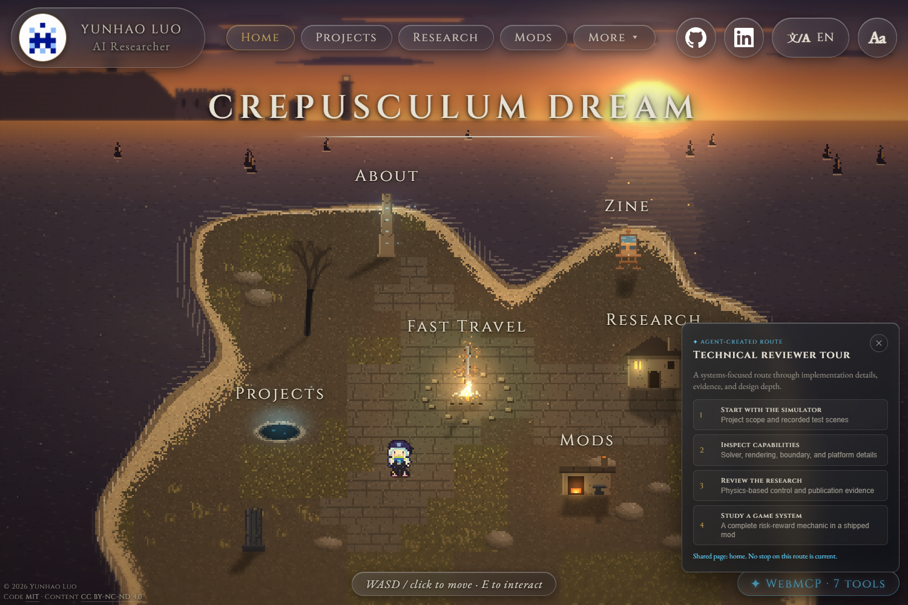

# Crepusculum Dream — A Playable WebMCP Portfolio

[Live competition edition](https://himeragiyukina.github.io/crepusculum-dream-webmcp/)

Baseline reference: [original live personal site](https://himeragiyukina.github.io/) · [original repository](https://github.com/HimeragiYukina/HimeragiYukina.github.io) · [last pre-challenge commit `5acdbc7`](https://github.com/HimeragiYukina/HimeragiYukina.github.io/commit/5acdbc7) · [challenge-period diff](https://github.com/HimeragiYukina/HimeragiYukina.github.io/compare/5acdbc7...5052cf2)

This is the self-contained, competition-safe edition of Yunhao Luo's playable portfolio. It is an HD-2D hub world that visitors explore with keyboard, pointer, or touch controls, while a WebMCP-capable agent collaborates through the same live router and DOM.

The primary audience is recruiters, research collaborators, and technical reviewers who need to understand a multidisciplinary portfolio without first knowing which pages matter to them. The global `create-portfolio-tour` tool converts that intent into a visible route that the visitor and agent can inspect and follow together.



## Site areas

| Landmark | Area | Content |
| --- | --- | --- |
| Bonfire | **Fast Travel** | Navigation to every site area |
| The Pit | **Projects** | Real-time GPU fluid-simulation engineering and recorded test scenes |
| The Mansion | **Research** | First-author MIG '21 publication, original summary, links, and complete BibTeX |
| The Smithy | **Mods** | A complete 78-card deck-building character mod, redacted gallery, and upstream links |
| The Easel | **Zine** | Original modern poetry and typographic experiments |
| The Monument | **About** | Biography, interests, photography, and WebMCP documentation |

## Human–agent collaboration

WebMCP tools register through `document.modelContext.registerTool`. They do not call a detached static portfolio API: navigation moves the visible page, updates the URL fragment and metadata, and replaces page-owned tools. Visible actions scroll and highlight the actual section the visitor is reading.

`create-portfolio-tour` is the central collaboration tool. It accepts a recruiting, research, technical-review, creative, or complete-portfolio goal and displays a persistent liquid-glass route panel. On first arrival a stop presents the destination introduction; selecting the same stop again centers and highlights its specific section below the fixed top bar.

### Tool scopes

| Scope | Tools |
| --- | --- |
| Every page | `list-site-pages`, `get-about-me`, `goto-site-page`, `set-language`, `create-portfolio-tour` |
| Home | `walk-hero-to-landmark`, `get-hero-status` |
| Every content page | Page-specific versions of `get-page-overview` and `focus-page-section` |
| Projects | `get-fluid-simulation` |
| Research | `get-publications`, `get-citation` |
| Mods | `get-mod-details`, `goto_workshop_page` |
| Zine | `read-zine-piece` |
| About | `get-photography-captions` |

Expected totals after the mounted page is ready: Home 7, Projects 8, Research 9, Mods 9, Zine 8, About 8.

## Challenge-period additions

The portfolio existed before the OpenAI WebMCP Challenge. The latest pre-challenge baseline is original-site commit [`5acdbc7`](https://github.com/HimeragiYukina/HimeragiYukina.github.io/commit/5acdbc7), dated August 17, 2026. Challenge-period implementation is preserved in the original repository through [`5052cf2`](https://github.com/HimeragiYukina/HimeragiYukina.github.io/commit/5052cf2); see the [`5acdbc7...5052cf2` comparison](https://github.com/HimeragiYukina/HimeragiYukina.github.io/compare/5acdbc7...5052cf2).

| Before the challenge | Added during the challenge |
| --- | --- |
| Global, Home, and Research tools | Page-aware registration and exclusive tools for every content area |
| Mostly off-screen returned data | Visible section focus and a shared goal-specific portfolio tour |
| Citation reading and clipboard writing combined | Read-only `get-citation`; copying remains an explicit button in the shared page UI |
| Basic definitions | Titles, strict schemas, trust/read annotations, cancellation, budgets, and Chrome 149 target |
| Generic metadata | Playable positioning, route-specific metadata, agent documentation, and repeatable tests |

[CHALLENGE.md](CHALLENGE.md) records the additions; [PROVENANCE.md](PROVENANCE.md) explains why this clean repository begins with a packaging commit rather than the original history.

## Competition-safe asset treatment

This repository intentionally does not contain the original site's identity-specific game artwork or adapted third-party ASCII mascots.

- The top-bar avatar is an original, anonymous blue-and-white pixel identicon created for this edition.
- The tiny procedural home-world traveler is retained because it reads as a generic gameplay-scale sprite.
- The Mods gallery uses newly generated, nonrepresentational coarse mosaics. Featured-card artwork is replaced by CSS color grids; relic icons are four plain blocks.
- The research teaser position is retained with a nonrepresentational mosaic. The bundled coauthored PDF and verbatim abstract are omitted; factual metadata, an original summary, DOI, author project link, and BibTeX remain available.
- Author-owned photography remains as the optimized WebP files used by the page; full-resolution source photographs are omitted. Original poetry, procedural environment art, and permitted fluid-simulation videos remain unchanged.

See [LICENSE-CONTENT](LICENSE-CONTENT) for the content-license boundary.

The clean-tree and restricted-original hash audit is recorded in [ASSET-AUDIT.md](ASSET-AUDIT.md).

## Technical overview

- Vite and TypeScript, without a frontend framework.
- Canvas 2D world rendered at a low internal resolution and scaled with nearest-neighbor interpolation.
- Deterministic procedural sprites, tiles, lighting, particles, bloom, depth blur, and color grading.
- English and Simplified Chinese interface support.
- Route-owned `AbortController` cleanup for page-scoped WebMCP registrations.
- Tool titles, strict JSON schemas, execution cancellation, trust/read annotations, and bounded descriptions/results.
- Route-specific browser, Open Graph, link-preview, sitemap, and `/llms.txt` metadata.

## Local development

Requirements: Node.js, npm, and Google Chrome.

```sh
npm install
npm run dev
npm run build
npm run test:webmcp
npm run capture:submission
```

`npm run test:webmcp` builds the production app, starts a local preview, launches headless Chrome, and checks all six tool surfaces, route cleanup, visible tour/focus behavior, read-only biography behavior, BibTeX structure, and Chrome's recommended tool-description and result budgets.

`npm run capture:submission` captures the Open Graph image and the rights-safe Devpost thumbnail/gallery directly from a running production preview. The ready-to-upload files are in [`submission-media/`](submission-media/).

For interactive testing without a native model-context host, append `?mockmcp` to the local URL and call tools from the console:

```js
window.__mcp.call('create-portfolio-tour', { goal: 'technical-reviewer' });
```

## Controls

- Move with `W`, `A`, `S`, and `D`, or select a destination with the pointer.
- Press `E` to interact with a landmark.
- Press `Esc` to close menus and content pages.

## License

Source code is available under the [MIT License](LICENSE). Original creative content and competition-specific visual assets have separate terms documented in [LICENSE-CONTENT](LICENSE-CONTENT).
